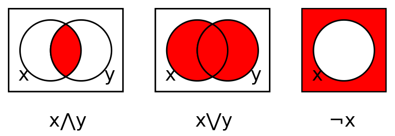

# Типы данных: boolean
## Введение
В информатике булев тип данных - это тип данных, который имеет одно из двух возможных значений: 0, 1, либо ложь и истина соответственно, предназначенных для представления двух истинных значений логики и булевой алгебры. Она названа в честь Джорджа Буля, который впервые определил алгебраическую систему логики в середине 19 века. Тип данных Boolean в первую очередь связан с условными операторами, которые допускают различные действия путем изменения потока управления в зависимости от того, оценивает ли указанное программистом логическое условие значение "истина" или "ложь". А также булева логика является частью "Вероятностной логики".
## Булева алгебра
### Базовые операторы
Итак, у нас есть 2 возможных значения переменной: "истина" и "ложь", и 3 базовых оператора:
1. "И" или "AND", именуемый конъюнкцией. Обозначается x∧y (иногда x AND y или Kxy), удовлетворяет x∧y = 1 (x И y = 1), если x = y = 1, и x∧y = 0 в противном случае. То есть конъюнкция между x и y равна 1, тогда и только тогда, когда и x, и y имеют значения равное 1.
2. "ИЛИ" или "OR", именуемый дизъюнкцией, обозначаемое x∨y (иногда x OR y или Axy), удовлетворяет x∨y = 0, если x = y = 0, и x∨y = 1 в противном случае. То есть дизъюнкция между x и y равна 1, тогда и только тогда, когда либо x, либо y имеют значения равное 1.
3. "НЕ" или "NOT", именуемый отрицанием, обозначаемое ¬x (иногда NOT x, Nx или! X), удовлетворяет ¬x = 0, если x = 1, и ¬x = 1, если x = 0. То есть оператор "отрицает" переменную и возвращает её противоположное значение.

#### Таблица истинности для базовых операторов

| x 	| y 	| x∧y 	| x∨y 	|
|---	|---	|-----	|-----	|
| 0 	| 0 	| 0   	| 0   	|
| 1 	| 0 	| 0   	| 1   	|
| 0 	| 1 	| 0   	| 1   	|
| 1 	| 1 	| 1   	| 1   	|

| x | ¬x |
|---|----|
| 0 | 1  |
| 1 | 0  |

### Диаграммы Венна

Диаграмма Венна является представлением булевой операции с использованием заштрихованных перекрывающихся областей. Существует одна область для каждой переменной, все циклические в примерах здесь. Внутренняя и внешняя части области x соответствуют значениям 1 (истина) и 0 (ложь) для переменной x. Затенение указывает на значение операции для каждой комбинации регионов, причем темный обозначает 1, а светлый 0 (некоторые авторы используют противоположное соглашение).

